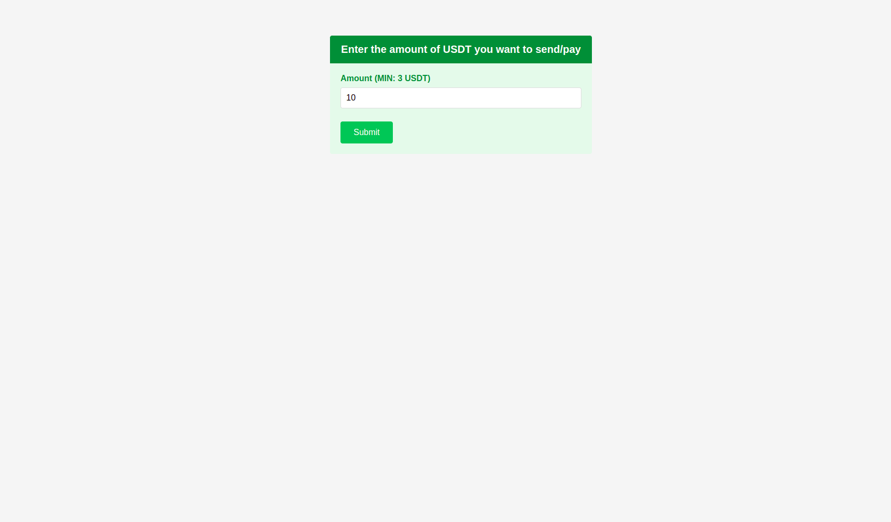
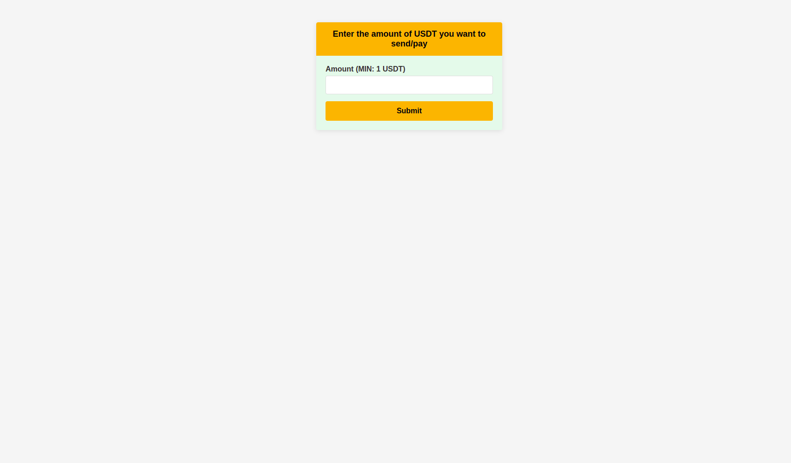
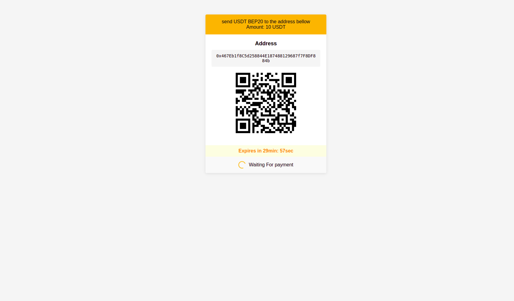
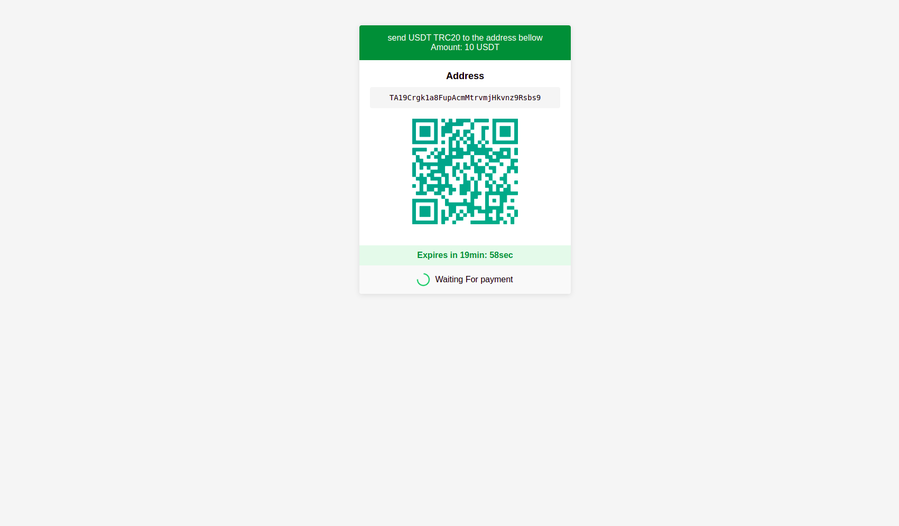

# Integrate USDT BEP20 Automatic Payments In a Laravel Application

Inspired by lakescripts.com + Claude 3.7 - We are here.
Just for experimental. DO NOT USE IN PRODUCTION

## Integrate Automatic USDT TRC20 Payments With HD Wallets In a Laravel Application

### This was fun

## Demo Screenshots

### USDT Payment Flow

1. USDT Amount Screen

2. BEP20 Amount Screen

### USDT Payment Flow

1. BEP20 Payment Screen

2. Payment Confirmation

